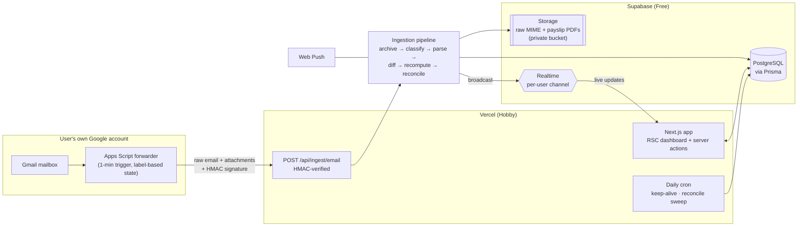

# Phase 4 — Architecture

**Status:** Approved (v1.1) — with the refinements recorded in §14. Phase 5 in
progress. Where §14 amends an earlier section, §14 wins; from Phase 5 onward the
code in this repository is the authoritative schema.

---

## 1. System overview



The defining decisions (argued in Phase 2):

1. **Push-based ingestion** from the user’s own Apps Script — no Gmail credentials
   held, no OAuth verification wall, ~1-minute latency, £0.
2. **Raw-first archiving** — every email stored immutably before interpretation;
   all parsed data is a rebuildable projection.
3. **Event-sourced shifts** — append-only `ShiftEvent` log + current-state `Shift`
   projection.
4. **Pure domain core** — payroll, statutory, parsing, and period math are
   framework-free TypeScript packages inside the app; I/O lives at the edges.
5. **Supabase Realtime** for the live dashboard; no bespoke socket infrastructure.

## 2. Module boundaries (Clean Architecture, pragmatically)

```
src/core      → Entities + domain services. Pure TS. Imports: nothing but itself.
src/server    → Use cases: services, repositories (Prisma), integrations, auth.
                Imports: core, prisma, supabase SDK. Never imports React/Next UI.
src/app       → Next.js App Router: RSC pages, server actions, route handlers.
                Imports: server (use cases), features (UI). No business logic.
src/features  → Feature-scoped client components + hooks (shifts, payroll, …).
src/components→ Cross-feature design system (shadcn/ui primitives + composites).
```

Dependency rule enforced with ESLint (`import/no-restricted-paths`): `core` imports
nothing; `server` never imports `app`/`features`; UI never imports Prisma. This is
the honest version of Clean Architecture for a Next.js monolith — layers as folders

- lint-enforced direction, no ceremony of one-interface-per-class. Repositories are
  interfaces in `server/repositories` with Prisma implementations; services receive
  dependencies via constructor injection (hand-rolled composition root in
  `server/container.ts`, no DI framework).

## 3. Folder structure

```
payslip/
├── docs/                            # design record (these files) + ADRs
├── prisma/
│   ├── schema.prisma
│   ├── migrations/
│   └── seed.ts                      # statutory config + Tracsis employer template
├── public/
├── scripts/
│   └── apps-script/forwarder.gs     # generated mailbox forwarder (template)
├── src/
│   ├── core/                        # ── PURE DOMAIN ──
│   │   ├── money/                   # Pence type, rounding policies
│   │   ├── periods/                 # pay-period schemes, tax-year math (Wed→Tue etc.)
│   │   ├── payroll/                 # rules engine: facts, condition DSL, components,
│   │   │                            #   explanation tree
│   │   ├── statutory/
│   │   │   ├── types.ts             # StatutoryCalculator port, config schema
│   │   │   └── uk/                  # PAYE cumulative/W1M1, NI per-period, pension,
│   │   │                            #   student loans
│   │   ├── parsing/                 # parser registry, classifiers, per-employer
│   │   │   └── tracsis/             #   parsers (versioned)
│   │   └── reconciliation/          # expected-vs-payslip diffing, tolerance model
│   ├── server/
│   │   ├── container.ts             # composition root
│   │   ├── db.ts                    # Prisma client (singleton)
│   │   ├── repositories/            # tenant-scoped data access
│   │   ├── services/                # IngestionService, PayrollService,
│   │   │                            #   ForecastService, NotificationService…
│   │   ├── integrations/
│   │   │   ├── mailbox/             # MailboxProvider port + AppsScriptPush adapter
│   │   │   ├── storage/             # Supabase Storage wrapper (signed URLs)
│   │   │   └── realtime/            # broadcast helper
│   │   └── auth/                    # Auth.js config, session helpers
│   ├── app/
│   │   ├── (marketing)/             # public landing (later)
│   │   ├── (app)/                   # authed shell: sidebar, command palette
│   │   │   ├── dashboard/
│   │   │   ├── shifts/              # list, calendar, timeline, [id] history
│   │   │   ├── payslips/            # list, [id] reconciliation view
│   │   │   ├── discrepancies/
│   │   │   ├── reports/
│   │   │   └── settings/            # employers+rules, tax profile, mailbox, system health
│   │   └── api/
│   │       ├── ingest/email/route.ts
│   │       ├── cron/daily/route.ts
│   │       └── auth/[...nextauth]/route.ts
│   ├── features/                    # client components + hooks per feature
│   ├── components/                  # ui/ (shadcn), charts/, layout/
│   └── lib/                         # env validation (zod), utils, constants
├── tests/
│   ├── fixtures/                    # anonymised email + payslip corpora
│   ├── integration/                 # services against real Postgres
│   └── e2e/                         # Playwright
├── .github/workflows/ci.yml         # lint → typecheck → unit → integration → e2e
└── package.json                     # pnpm, MIT
```

## 4. Data model (Prisma sketch — implemented in Phase 5)

Conventions: cuid PKs; `userId` tenant key on every domain table (indexed);
all money integer pence; all timestamps UTC + IANA timezone where wall-clock
matters; JSONB payloads validated by zod schemas whose versions are stored
alongside.

```prisma
// ── Identity & tenancy ─────────────────────────────────────────────
model User {
  id, email, name, image, createdAt
  settings           Json         // notification prefs, UI prefs
}
model TaxProfile {                 // per user per tax year per jurisdiction
  userId, jurisdiction, taxYear    // e.g. ("UK", "2026-27")
  taxCode, taxBasis                // 1257L, CUMULATIVE | W1M1
  niCategory                       // A…
  pension            Json?        // scheme type, employee %, salary sacrifice?
  studentLoan        String?      // PLAN_1 | PLAN_2 | PLAN_4 | PLAN_5 | PG
}

// ── Employer configuration ─────────────────────────────────────────
model Employer {
  id, userId, name, timezone, currency, jurisdiction
  payPeriodScheme    Json         // {kind:"FORTNIGHTLY_ANCHORED", anchorStart:"2026-04-15",
                                  //  payDateOffsetDays:8, overrides:[...transition periods]}
  roundingPolicy     Json         // per-component rounding rules
  senderPatterns     Json         // email matching hints for classifier
}
model RateClass {                  // "Hands-Free", "Reserved Parking"
  id, employerId, name, slug
}
model RateVersion {                // rates change over time
  id, rateClassId, effectiveFrom, effectiveTo?
  components         Json         // [{type:"BASE", pencePerHour:1388},
                                  //  {type:"HOLIDAY_ROLLED_UP", percentOfBase:12.07}]
}
model RuleSet {                    // versioned, ordered assignment rules
  id, employerId, version, effectiveFrom, status   // DRAFT | ACTIVE | RETIRED
  rules              Json         // [{priority, name, when:<condition DSL>,
                                  //   then:{assignRateClass:"reserved-parking"}}]
}

// ── Ingestion (append-only) ────────────────────────────────────────
model EmailMessage {
  id, userId, dedupeKey @unique    // hash(rfc822 Message-ID + account)
  receivedAt, subject, fromAddress
  rawStorageKey                    // Supabase Storage object (immutable)
  classification                   // ROTA | ROTA_CHANGE | CANCELLATION | PAYSLIP | PAY_COMMS | OTHER
  parseStatus                      // PENDING | PARSED | QUARANTINED | IGNORED
  parserId?, parserVersion?, parsedAt?, parseError?
}
model IngestionRun {               // one per pipeline execution (push, sweep, replay)
  id, userId, trigger              // PUSH | SWEEP | REPLAY | BACKFILL
  startedAt, finishedAt, stats Json
}

// ── Shifts (event log + projection) ────────────────────────────────
model Shift {                      // current-state projection
  id, userId, employerId
  externalRef?                     // employer's shift id if present in rota
  date, startAt, endAt, timezone
  role, venue, notes?
  status                           // SCHEDULED | AMENDED | CANCELLED | COMPLETED
  rateClassOverrideId?             // manual override (beats rules)
  version                          // = count of events applied
  @@index([userId, employerId, date])
}
model ShiftEvent {                 // append-only; never updated or deleted
  id, shiftId, userId, seq
  kind                             // CREATED | AMENDED | CANCELLED | REINSTATED |
                                   //   MANUAL_EDIT | OVERRIDE_SET
  sourceEmailId?                   // evidence link (null ⇒ manual, actor recorded)
  snapshot Json, diff Json?
  occurredAt, recordedAt
}

// ── Payroll & reconciliation ───────────────────────────────────────
model PayPeriod {                  // materialised per employer
  id, userId, employerId, sequence, startDate, endDate, expectedPayDate
  @@unique([employerId, sequence])
}
model ExpectedPay {                // recomputable projection; superseded, kept for history
  id, userId, payPeriodId, computedAt, current Boolean
  engineVersion, ruleSetVersion, statutoryConfigId, ytdAnchorPayslipId?
  grossPence, taxPence, niPence, pensionPence, netPence
  lines Json                       // explanation tree (per shift, per component)
}
model Payslip {
  id, userId, employerId, payPeriodId?
  sourceEmailId?, documentStorageKey?
  payDate, grossPence, taxPence, niPence, pensionPence, netPence
  ytd Json                         // YTD gross/tax/NI — the cumulative anchor
  lines Json                       // parsed line items
  reference?                       // encrypted (see §9)
}
model Discrepancy {
  id, userId, payPeriodId, payslipId?
  kind                             // MISSING_SHIFT | RATE_MISMATCH | HOURS_MISMATCH |
                                   //   HOLIDAY_PCT | DEDUCTION_MISMATCH | ROUNDING | …
  severity                         // INFO | MINOR | MAJOR
  expectedPence, actualPence, deltaPence
  status                           // OPEN | ACKNOWLEDGED | RESOLVED | EXPECTED_WRONG
  evidence Json                    // shift ids, event ids, email ids, rule refs
}

// ── Statutory config (seeded data, not code) ───────────────────────
model StatutoryConfig {
  id, jurisdiction, taxYear, effectiveFrom
  config Json                      // bands, thresholds, NI categories, SL thresholds…
  source                           // provenance note (gov.uk URL, date checked)
  @@unique([jurisdiction, taxYear])
}

// ── Ops ────────────────────────────────────────────────────────────
model Notification { id, userId, type, payload Json, createdAt, readAt?, pushedAt? }
model PushSubscription { id, userId, endpoint @unique, keys Json, createdAt }
model IngestionSecret { id, userId, secretHash, label, createdAt, lastUsedAt?, revokedAt? }
```

Notes:

- **Auth tables** (Auth.js Prisma adapter: Account/Session/VerificationToken) are
  separate from domain tables.
- **Why JSONB for rules/components/lines:** these are _documents_ — versioned,
  schema-validated (zod), read whole, never joined against. Relational explosion
  (RuleConditionRow…) would multiply migrations for zero query value. Fields we
  filter/aggregate on (dates, money totals, statuses, tenant keys) are proper
  columns. This is the standard Postgres-as-document-store-for-config pattern.
- **RLS:** Supabase is accessed by Prisma as a single privileged role, so app-layer
  tenancy (scoped repositories + tests) is the real boundary; RLS is added as
  defence-in-depth for any future direct-from-client Supabase access (Realtime
  channel authorisation uses it from day one).

## 5. Ingestion pipeline

Stages; each idempotent and resumable; failures park the message, never drop it:

```
receive → verify HMAC(+timestamp, replay window) → dedupe (dedupeKey)
        → archive raw to Storage (immutable)                 [durable from here]
        → classify (sender/subject/structure heuristics per employer)
        → parse (versioned parser registry) ──fail──▶ QUARANTINE (UI resolve → fixture)
        → match & diff against existing shifts (externalRef → natural key
          date+venue+role → fuzzy window; ambiguous ⇒ quarantine, never guess)
        → append ShiftEvents, update projections
        → recompute ExpectedPay for affected periods (supersede, keep history)
        → reconcile if payslip exists → Discrepancies
        → notify (in-app + Web Push) → broadcast (Realtime)
```

- **Apps Script contract:** POST JSON `{messageId, receivedAt, headers, raw (base64,
size-capped), attachments[]}` signed with `HMAC-SHA256(secret, timestamp‖body)`;
  script labels the Gmail thread `payslip/synced` only on 2xx — so state lives in
  Gmail and retries are automatic. Oversized payloads send metadata only and are
  fetched via the daily sweep’s re-request path.
- **Daily sweep (cron):** detects gaps (forwarder silent while mail expected),
  re-runs quarantine candidates against newer parser versions, keep-alive, forecast
  refresh.
- **Serverless fit:** every stage is short; the pipeline runs within one function
  invocation for typical emails, but stage boundaries checkpoint to Postgres so a
  timeout resumes cleanly on the next trigger.

## 6. Payroll & statutory engines (core)

**Rules engine** — pure evaluation:
`evaluate(shift, employerConfig) → {rateClass, components[], explanation}`.
Facts derived from the shift: `dayOfWeek`, `scheduledHours`, `role`, `venue`,
`isOverridden`, … Condition DSL (closed grammar, zod-validated):

```json
{
  "priority": 10,
  "name": "Sunday hands-free uplift",
  "when": {
    "all": [
      { "fact": "role", "op": "eq", "value": "hands-free" },
      { "fact": "dayOfWeek", "op": "eq", "value": "SUN" }
    ]
  },
  "then": { "assignRateClass": "reserved-parking" }
}
```

Precedence: manual override → first matching rule by priority → role default.
Components from the winning class’s `RateVersion` effective on the shift date
(BASE pence/hour; HOLIDAY_ROLLED_UP percent-of-base with configured rounding).
Output is an **explanation tree**, never a bare number (Phase 3 §2).

**Statutory engine** — `StatutoryCalculator` port:
`calculate(periodGross, periodIndex, profile, config, ytdAnchor) → {lines[], explanation}`.
UK implementation: PAYE cumulative (code-derived allowance apportioned by period,
W1/M1 basis supported), NI per-period (fortnight = 2× weekly thresholds, category
tables from config), pension (qualifying-earnings or fixed %), student loans.
Thresholds all come from `StatutoryConfig` rows (seeded 2025-26 and 2026-27,
provenance-noted, verified against gov.uk before Phase 8 sign-off). YTD anchoring
per Phase 2 §3.

**Pay-period math** — `periods/` resolves any date to (employer, sequence, start,
end, payday) from the scheme config, including the April 2026 transition overrides;
tax-year (6 Apr–5 Apr) helpers live here too.

## 7. API surface

Mutations use **server actions** (typed, colocated, CSRF-safe); route handlers exist
only where a non-browser caller needs a URL:

| Route                              | Auth                 | Purpose                             |
| ---------------------------------- | -------------------- | ----------------------------------- |
| `POST /api/ingest/email`           | HMAC + timestamp     | Apps Script push                    |
| `POST /api/cron/daily`             | `CRON_SECRET` header | keep-alive, sweep, forecasts        |
| `GET/POST /api/auth/[...nextauth]` | —                    | Auth.js (Google, basic scopes only) |

Server actions (representative): `connectMailbox` / `rotateIngestionSecret`,
`saveEmployer`, `saveRuleSet` (+ `testRuleSet(sampleShifts)`), `saveTaxProfile`,
`createShift`/`amendShift`/`cancelShift`/`setShiftOverride`,
`resolveQuarantinedEmail`, `acknowledgeDiscrepancy`, `exportEvidencePack`,
`subscribePush`. Reads are RSC data fetching through repositories; client
interactivity revalidates via Realtime-triggered router refresh.

## 8. Frontend architecture

Shell: sidebar navigation + command palette (`cmd+k`), theme toggle, notification
tray — the Linear pattern. RSC-first: pages fetch on the server; client components
only where interactive (calendar, charts, rule editor, palette).

```
(app)/layout        → AppShell [Sidebar, CommandPalette, NotificationTray, RealtimeProvider]
dashboard/          → StatGrid [HoursCard, GrossNetCard, DeductionsCard, ForecastCard]
                      UpcomingShifts · RecentChanges (semantic diffs) ·
                      VerificationStatus · EarningsChart (Recharts) · WhatIfPanel
shifts/             → ShiftList (virtualised, instant filter) · ShiftCalendar ·
                      ShiftTimeline · ShiftDetail [EventHistory, PayBreakdown(explanation tree)]
payslips/[id]       → ReconciliationView [ExpectedVsActualTable, DiscrepancyList,
                      EvidencePackButton]
settings/           → EmployerConfig [RateClassEditor, RuleSetEditor(+RuleTester),
                      PeriodSchemePreview] · TaxProfileForm · MailboxSetup
                      [ScriptGenerator, HealthIndicator] · SystemHealth
```

State: server state via RSC + revalidation (no client cache library to start;
SWR only if a genuinely client-polled view appears). Realtime provider maps
channel events → `router.refresh()` + toast. Design tokens via Tailwind +
shadcn/ui theming; dark/light via `prefers-color-scheme` + toggle.

## 9. Security (OWASP-mapped highlights)

- **No mailbox credentials held** (A02/A07 class risk removed structurally) — the
  single biggest win, from the push model.
- **Ingestion endpoint:** HMAC-SHA256 with per-user secret (hashed at rest,
  rotatable, `IngestionSecret`), timestamp window against replay, body-size caps,
  content-type allowlist for attachments (A01/A03/A08).
- **AuthN/Z:** Auth.js with Google (openid/email/profile only — no sensitive
  scopes), database sessions (revocable), every repository call tenant-scoped by
  construction + cross-tenant tests (A01).
- **Sensitive data:** payslip PDFs and raw emails in a **private** Storage bucket,
  server-generated short-lived signed URLs only; payslip reference / any NI-number
  field application-encrypted (AES-256-GCM, key in env, versioned for rotation);
  never render NI/address/bank details in UI beyond last-4 style (A02).
- **Secrets:** environment only (Vercel encrypted env vars), zod-validated at boot,
  `.env.example` documented, no secrets in repo (A05).
- **Injection:** Prisma parameterised queries; all external input (emails included —
  hostile input by definition) zod-parsed at the boundary; rule DSL is a closed
  grammar, never evaluated as code (A03).
- **Logging/monitoring:** Sentry free tier with `beforeSend` PII scrubbing; no email
  bodies or money amounts in logs; audit trail via the event log itself (A09).
- **Headers:** CSP, HSTS, frame-deny, referrer-policy via `next.config` (A05).
- **Supply chain:** pnpm lockfile, Dependabot, CI audit gate (A06).

## 10. Testing strategy

| Layer               | Tool                                                       | What                                                                                       |
| ------------------- | ---------------------------------------------------------- | ------------------------------------------------------------------------------------------ |
| core/money, periods | Vitest + fast-check                                        | rounding properties, DST cases, period math incl. April 2026 transition                    |
| core/payroll        | Vitest golden fixtures                                     | Tracsis scenarios: Sunday rule, 10-hour rule, override precedence, rate-version boundaries |
| core/statutory      | Vitest                                                     | HMRC worked examples per tax year; cumulative vs W1/M1; NI per-period                      |
| core/parsing        | Vitest fixture corpus                                      | every real (anonymised) email ever quarantined or parsed; parser-version regression        |
| core/reconciliation | Vitest                                                     | tolerance model, discrepancy classification                                                |
| server              | Vitest integration vs real Postgres (CI service container) | pipeline idempotency (same email twice), tenant isolation, checkpoint/resume               |
| e2e                 | Playwright                                                 | auth, ingest-to-dashboard happy path (simulated push), quarantine resolve, rule editing    |
| CI                  | GitHub Actions                                             | lint → typecheck → unit → integration → e2e → build; Husky pre-commit lint-staged          |

The pyramid is deliberately bottom-heavy: the product’s value is in the engines,
and they are pure functions — cheap to test exhaustively.

## 11. Cost model (the £0 audit)

| Service                  | Free limit (checked Jul 2026)                                       | Our usage (1 user)          | First paid trigger                       |
| ------------------------ | ------------------------------------------------------------------- | --------------------------- | ---------------------------------------- |
| Vercel Hobby             | non-commercial; daily-only crons; 100GB bandwidth                   | tiny; 1 daily cron          | going commercial → Pro ~$20/mo           |
| Supabase Free            | 500MB DB, 1GB storage, Realtime incl., **pauses after 7 idle days** | MBs of rows; ~100KB/payslip | ~2 yrs of raw email at worst; Pro $25/mo |
| Apps Script              | consumer quotas ≫ need (~90 min triggers/day)                       | seconds/day                 | effectively never                        |
| Auth.js + Google sign-in | free, basic scopes                                                  | 1 user                      | never (verification only if SaaS)        |
| GitHub Free + Actions    | 2000 CI min/mo private                                              | ~200 min/mo                 | public repo ⇒ unlimited                  |
| Sentry / PostHog         | 5k errors / 1M events mo                                            | trivial                     | not before real traffic                  |
| Web Push (VAPID)         | free protocol                                                       | trivial                     | never                                    |

Mitigations wired into the design: daily keep-alive (pause risk), storage in
Storage-not-Postgres (500MB), nothing schedule-precise (cron limits), and full
portability (plain Postgres + S3-style storage) if any tier turns hostile.

## 12. Delivery plan (maps to your Phases 5–12)

| Phase            | Deliverable                                                                                                                   | Definition of done                                       |
| ---------------- | ----------------------------------------------------------------------------------------------------------------------------- | -------------------------------------------------------- |
| 5 Database       | Prisma schema, migrations, seeds (statutory 25-26/26-27, Tracsis template), repository layer                                  | migrations apply cleanly; tenant-isolation tests green   |
| 6 Auth           | Auth.js Google sign-in, app shell, protected routes                                                                           | sign-in/out; sessions revocable                          |
| 7 Ingestion      | Ingest endpoint, Apps Script generator + setup UI, archive/classify/parse (needs your sample emails), quarantine UI, backfill | real rota email → shifts in DB ≤ 90s; replay idempotent  |
| 8 Payroll        | Rules engine, period math, statutory UK, ExpectedPay projections, reconciliation + discrepancies                              | Tracsis fixture periods match real payslips to the penny |
| 9 Dashboard      | All FR-7 views, explanation trees, what-if panel, Realtime                                                                    | live update on ingest; a11y pass                         |
| 10 Notifications | In-app + Web Push, semantic diff content, system health card                                                                  | push received on rota change                             |
| 11 Testing       | Full pyramid to target coverage, fixture corpus tooling                                                                       | CI green, mutation-spot-checks on engines                |
| 12 Deployment    | Vercel + Supabase provisioning docs, env validation, Sentry, runbook                                                          | cold deploy from README in <30 min                       |

## 13. Decision log (ADR summary)

| #   | Decision                                 | Alternatives rejected                                                                                        | Why                                                            |
| --- | ---------------------------------------- | ------------------------------------------------------------------------------------------------------------ | -------------------------------------------------------------- |
| 1   | Apps Script push ingestion (v1)          | Gmail API OAuth (7-day token death / CASA wall); IMAP app-password (stores full-mailbox credential; polling) | free, live, zero stored credentials                            |
| 2   | Supabase (DB+Storage+Realtime)           | Neon (no storage/realtime), Postgres+S3 mix                                                                  | one free service, three needs; plain-Postgres portability kept |
| 3   | Supabase Realtime for liveness           | SSE/WS on Vercel                                                                                             | serverless-hostile connections avoided                         |
| 4   | Event log + projection for shifts        | CRUD updates; full ES/CQRS                                                                                   | history is the product; replay-only ES is overkill             |
| 5   | Raw-first email archiving                | parse-and-discard                                                                                            | reprocessability, evidence, fixtures                           |
| 6   | Closed JSON rule DSL                     | expression language; hardcoded rules                                                                         | expressive enough, injectable never                            |
| 7   | Statutory tables as seeded data          | constants in code                                                                                            | April is a data update, not a release                          |
| 8   | Integer pence + explicit rounding config | floats; implicit rounding                                                                                    | payslip-grade correctness                                      |
| 9   | Server actions + minimal route handlers  | tRPC/GraphQL                                                                                                 | one app, no API consumers yet                                  |
| 10  | Tenancy as schema discipline only (v1)   | full org/RBAC now; single-user schema                                                                        | avoids both rewrite and YAGNI                                  |

## 14. v1.1 refinements (approved by product owner)

### 14.1 Provider-agnostic email ingestion

The mailbox integration is formalised as a **domain port**, `EmailIngestionProvider`
(`src/core/ingestion/`). The domain and pipeline know only the port’s types
(`IncomingEmail`, `IngestionCursor`, verification results) — never a vendor SDK.
Two provider shapes are modelled explicitly, because they are architecturally
different:

- **Push providers** (Apps Script forwarder — v1; generic signed webhook): the
  provider verifies an inbound HTTP request (HMAC, timestamp window) and extracts
  an `IncomingEmail`.
- **Pull providers** (Gmail API, IMAP, Microsoft Graph/Outlook — future): the
  provider is polled with an opaque `cursor` and returns new emails plus the next
  cursor; credentials handling stays entirely inside the adapter.

A `MailboxConnection` entity (per user, per mailbox) records the provider kind,
non-secret config, and health state; ingestion secrets/credentials hang off the
connection, hashed or encrypted. Everything downstream of
`IngestionService.receive(IncomingEmail)` is provider-blind, so adding Outlook
later touches zero domain code. ADR 1 stands: Apps Script push is the first
adapter, not the architecture.

### 14.2 Rich domain model (DDD layering)

The domain layer (`src/core/domain/`) is organised around **entities and value
objects with behaviour**, not service procedures: `Employer`, `Contract`, `Role`,
`Shift` (aggregate root over `ShiftEvent`s, enforcing invariants such as
“cancelled shifts must be reinstated before amendment”), `PayrollPeriod` +
`PayPeriodScheme` (owning all period math), `Payslip`, `Rule`/`RuleSet` (owning
`matches(shift)`) with the `RuleEngine` as a domain service, `Money` (integer
pence + currency + explicit rounding), `EvidencePack`, and `Notification`.
Services in `src/server` shrink to orchestration: load aggregates → invoke domain
behaviour → persist → publish.

Two entities are **promoted** relative to §4:

- **`Contract`** — the employment relationship between a user and an employer
  (start/end dates, encrypted employee reference, optional per-contract pay-period
  override). `Shift` and `Payslip` now reference a contract; this is what makes
  multiple concurrent employers (and later, changed terms at the same employer)
  first-class rather than stringly-typed.
- **`Role`** — previously a string on `Shift`; now an employer-scoped entity with
  a default rate class (`Hands-Free` role → `Hands-Free` rates unless a rule or
  override says otherwise). Rules reference role slugs; the rule DSL is unchanged.

`EvidencePack` also becomes a persisted entity (generated document + structured
evidence graph), not just a rendering.

Persistence models (Prisma) are **not** the domain model: repositories map
between the two, and the domain layer never imports Prisma. The §4 sketch is
superseded by `prisma/schema.prisma` from Phase 5 onward.

### 14.3 AI bounded context

A separate bounded context (`src/core/ai/` ports; `src/server/ai/` adapters —
implemented post-Phase 9) for forecasting, narrative explanations,
recommendations, and natural-language payroll queries. Boundary rules, which are
the whole point:

- **AI reads projections; it never writes ledger state.** Inputs are the same
  read models humans see (explanation trees, shift history, period results);
  outputs are suggestions, narratives, and _proposed_ actions that go through the
  same server actions as a human would.
- **Deterministic engines remain the source of numeric truth.** The AI layer may
  rephrase or explore (“what if I drop Saturday?” compiles to a what-if engine
  run — Phase 3 §9); it never computes pay itself.
- **Provider-agnostic**: `LanguageModelPort` with an Anthropic adapter first;
  degradable to zero-cost heuristics (the statistical forecaster) so the free
  tier keeps working with AI features off.
- Ports defined in Phase 5 as code (`ForecastModel`, `ExplanationNarrator`,
  `RecommendationEngine`, `PayrollQueryAgent`); implementations are explicitly
  out of v1 scope.

### 14.4 Offline-first PWA

The app ships as a **Progressive Web App** (Serwist service worker + manifest,
added with the app shell in Phase 6):

- **Reads work offline.** The app shell is precached; dashboard read models
  (current period, shifts, payslips, discrepancies) are cached in IndexedDB with
  a stale-while-revalidate policy and an explicit “as of &lt;time&gt;” staleness
  indicator — honesty over illusion.
- **v1 offline writes: none.** Mutations queue is deferred; offline users can
  view everything and see clearly that actions need connectivity. Rationale: the
  write paths that matter (ingestion) are server-side anyway; client mutation
  queues + conflict resolution are complexity with almost no v1 payoff. Later,
  low-risk mutations (acknowledge discrepancy, mark notification read) adopt
  Background Sync first.
- **Sync is automatic** on reconnect/focus via revalidation + the Realtime
  channel; the cache is always a projection of server truth (server wins — no
  merge semantics needed while writes are online-only).
- Cached payroll data on-device is within the user’s own device trust boundary;
  the cache is scoped per signed-in user and purged on sign-out.

### 14.5 ADR additions

| #   | Decision                                                                                     | Alternatives rejected                                                   | Why                                                                   |
| --- | -------------------------------------------------------------------------------------------- | ----------------------------------------------------------------------- | --------------------------------------------------------------------- |
| 11  | `EmailIngestionProvider` port with push/pull provider shapes                                 | Apps-Script-shaped pipeline                                             | Outlook/IMAP/Gmail-API arrive as adapters, domain untouched           |
| 12  | Rich domain entities incl. `Contract`, `Role`; Prisma models mapped at repository boundary   | anemic models = Prisma types everywhere                                 | behaviour lives with data; persistence swappable; invariants testable |
| 13  | AI as bounded context over read models, never in the calculation loop                        | AI-computed payroll; AI omitted from design                             | trustworthy numbers + useful language layer; degradable to £0         |
| 14  | PWA offline = cached reads + online-only writes (v1)                                         | full offline CRDT/queue sync                                            | 90% of value, 10% of complexity; ingestion is server-side regardless  |
| 15  | Ingestion HMAC keys HKDF-derived per (connection, version); only a verification hash at rest | storing secrets hashed (impossible for HMAC); storing encrypted secrets | DB breach alone yields nothing; rotation is a version bump            |

---

**Next:** Phase 5 — schema, migrations, statutory seeds, domain core, and the
repository layer with tenant-isolation tests. Sample rota emails + one payslip
(Phase 1 §9) unblock Phase 7’s parser work and can be gathered in parallel.
